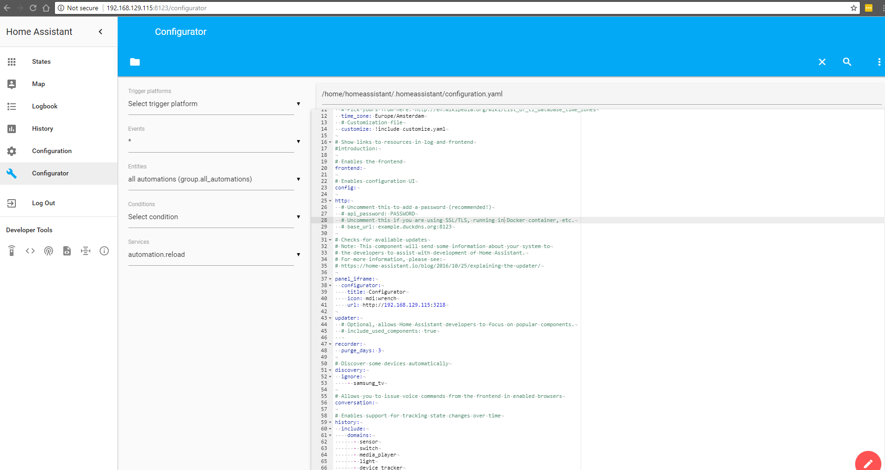

# hass-configurator
how i do hass-configurator



credits to: https://github.com/danielperna84/hass-configurator

### Installation
There are no dependencies on Python modules that are not part of the standard library. And all the fancy JavaScript libraries are loaded from CDN (which means this doesn't work when you're offline).  
- Copy [configurator.py](configurator/configurator.py) to HASS configuration directory (e.g `cd /home/homeassistant/.homeassistant/configurator`)
- Make it executable (`sudo chmod 755 configurator.py`)
- (Optional) Set the `GIT` variable in configurator.py to `True` if [GitPython](https://gitpython.readthedocs.io/) is installed on your system
- Copy [settings.conf](hass-configurator/configurator/settings.conf) to the same folder
- Execute it (`sudo ./configurator.py /home/homeassistant/.homeassistant/configurator/settings.conf`) for testing purpose
- To terminate the process do the usual `CTRL+C`, maybe once or twice


### Home Assistant
- Add lines from [configuration.yaml](hass-configurator/configuration.yaml) into home-assistant configuration.yaml file

### systemd
- Copy [hassconfigurator.service](hass-configurator/etc/systemd/system/hassconfigurator.service) to `etc/systemd/system/`.

Integrate it as mentioned in the [HASS documentation](https://home-assistant.io/getting-started/autostart-systemd/). If you use this method you have to set the `BASEPATH` variable in settings.conf according to your environment.

So, in short:
- You need to reload `systemd` to make the daemon aware of the new configuration. 

```bash
$ sudo systemctl --system daemon-reload
```

- To start Hass-configurator automatically at boot, enable the service.

```bash
$ sudo systemctl enable hassconfigurator.service]
```

To disable the automatic start, use this command.

```bash
$ sudo systemctl disable hassconfigurator.service]
```

- To start Hass-configurator now, use this command.
```bash
$ sudo systemctl start hassconfigurator.service]
```

You can also substitute the `start` above with `stop` to stop Home Assistant, `restart` to restart Home Assistant, and 'status' to see a brief status report
